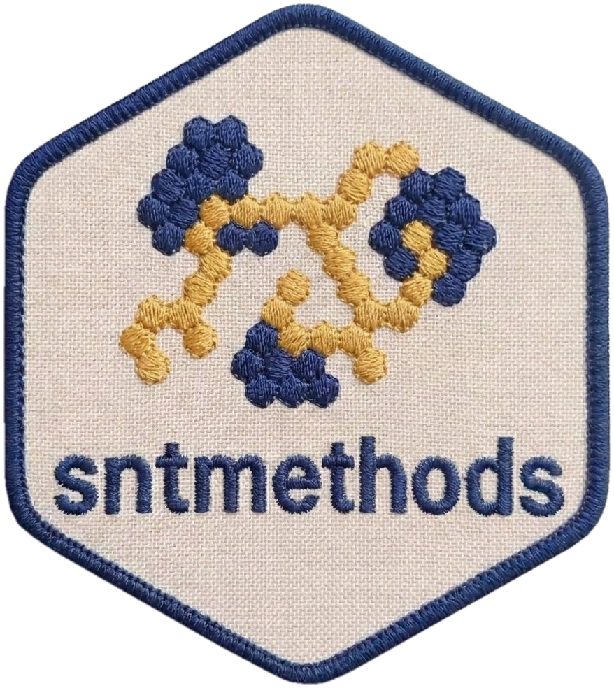

# sntmethods 

<!-- badges: start -->

[](https://github.com/ahadi-analytics/sntmethods/actions/workflows/R-CMD-check.yaml)
[](https://github.com/ahadi-analytics/sntmethods/actions/workflows/pkgdown.yaml)
[](https://github.com/ahadi-analytics/sntmethods/actions/workflows/lint.yaml)


<!-- badges: end -->

Analytical methods for Sub-National Tailoring (SNT) of malaria control
strategies. `sntmethods` turns DHS/MIS survey microdata and routine health
facility data into survey-weighted indicators, model-based geostatistical
surfaces, and incidence estimates for sub-national program planning. It is the
analytical companion to
[`sntutils`](https://github.com/ahadi-analytics/sntutils) (data I/O, cleaning,
dictionaries, spatial validation).

## What this package does

Three workflows, each with a dedicated guide on the
[package website](https://ahadi-analytics.github.io/sntmethods/):

- **[DHS survey analysis](https://ahadi-analytics.github.io/sntmethods/articles/dhs-survey-analysis.html)**
  — survey-weighted, design-correct estimates for 100+ indicators across 16
  domains, with confidence intervals and admin stratification. Every family
  ships a machine-readable data dictionary, and you can inspect the available
  DHS variables _before_ building any indicator.
- **[Spatial modeling (MBG)](https://ahadi-analytics.github.io/sntmethods/articles/spatial-modeling.html)**
  — model-based geostatistics that turns cluster-level survey data into
  continuous raster surfaces and population-weighted admin estimates, via
  `fit_mbg_indicator()` (single indicator) or `run_mbg_pipeline()` (full
  pipeline across 14 indicator families).
- **[Routine data: incidence & TPR](https://ahadi-analytics.github.io/sntmethods/articles/routine-incidence.html)**
  — malaria incidence from facility data using the N0-N5 cascade, test
  positivity with structured fallbacks, and STL + Mann-Kendall
  [trend analysis](https://ahadi-analytics.github.io/sntmethods/articles/trend-analysis.html).

All estimators return tidy, long-format tables keyed by admin level (`adm0`,
`adm1`, `adm2`) with `point`, `ci_l`, `ci_u`, `numerator`, `denominator`, and
indicator metadata — so survey and modeled estimates stack cleanly.

## Installation

```r
# install.packages("pak")
pak::pkg_install("ahadi-analytics/sntmethods")
```

Spatial features need GDAL/GEOS/PROJ system libraries, and the MBG workflow
additionally needs INLA and the `mbg` engine. See
[Get started → Install](https://ahadi-analytics.github.io/sntmethods/articles/getting-started.html#install)
for the full instructions.

## Quick start

```r
library(sntmethods)

# Discover surveys and inspect variables BEFORE building indicators
ge <- dhs_read(path = "path/to/parquet", file_type = "GE",
               survey_type = "DHS", country_code = "TG")
kr <- dhs_read(path = "path/to/parquet", file_type = "KR",
               country_code = "TG", survey_year = 2017)
make_dhs_raw_dictionary(kr)        # full variable list for the recode

# Compute a survey-weighted indicator
fever <- calc_fever_dhs(dhs_kr = kr, gps_data = ge,
                        shapefile = shp_admin, admin_level = c("adm0", "adm1"))
```

See the [Get started guide](https://ahadi-analytics.github.io/sntmethods/articles/getting-started.html)
for the full tour, and
[`inst/scripts/`](https://github.com/ahadi-analytics/sntmethods/tree/master/inst/scripts)
for complete, runnable examples.

## Documentation

| Guide                                                                                                         | Topic                                                       |
| ------------------------------------------------------------------------------------------------------------- | ----------------------------------------------------------- |
| [Get started](https://ahadi-analytics.github.io/sntmethods/articles/getting-started.html)                     | Overview, installation, a short end-to-end tour             |
| [DHS survey analysis](https://ahadi-analytics.github.io/sntmethods/articles/dhs-survey-analysis.html)         | Survey discovery, variable inspection, 16 indicator domains |
| [Spatial modeling (MBG)](https://ahadi-analytics.github.io/sntmethods/articles/spatial-modeling.html)         | `fit_mbg_indicator()` and `run_mbg_pipeline()`              |
| [Routine data: incidence & TPR](https://ahadi-analytics.github.io/sntmethods/articles/routine-incidence.html) | N0-N5 cascade, TPR fallbacks                                |
| [Trend analysis](https://ahadi-analytics.github.io/sntmethods/articles/trend-analysis.html)                   | STL + Mann-Kendall + Sen's slope                            |
| [Methodology & conventions](https://ahadi-analytics.github.io/sntmethods/articles/methodology.html)           | Indicator specs, naming, dictionaries                       |
| [Reference](https://ahadi-analytics.github.io/sntmethods/reference/index.html)                                | Every exported function                                     |

Indicator methodology specs (variable mappings, inclusion criteria, WHO/WMR
references) live as machine-readable YAML in
[`inst/methods/`](https://github.com/ahadi-analytics/sntmethods/tree/master/inst/methods).

## Related packages

- [**sntutils**](https://github.com/ahadi-analytics/sntutils) — companion
  utilities (data I/O, dictionaries, cleaning, spatial validation)
- [**DHS.rates**](https://CRAN.R-project.org/package=DHS.rates) — standard DHS
  mortality rate calculations
- [**mbg**](https://github.com/ihmeuw/mbg) — model-based geostatistics engine (IHME)

## License

MIT
